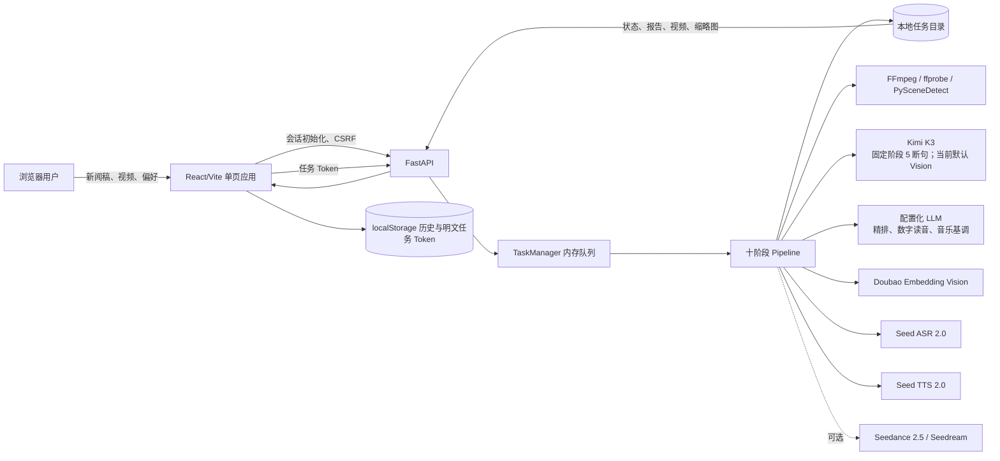
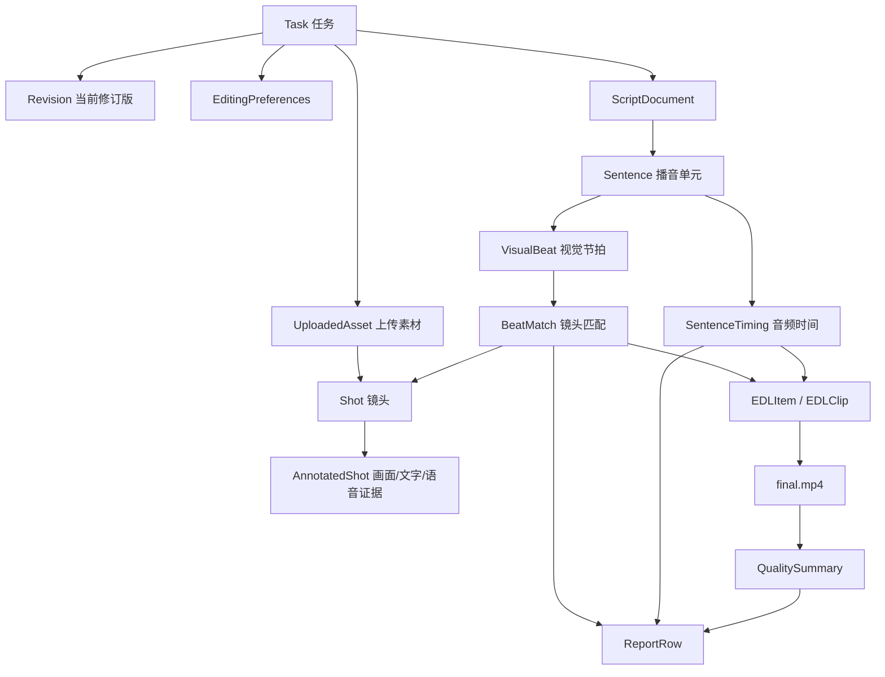
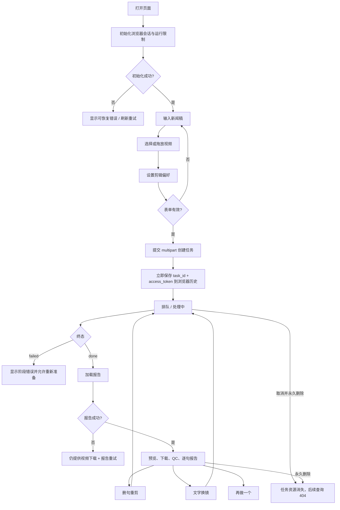
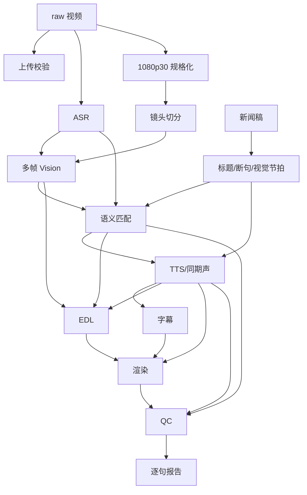
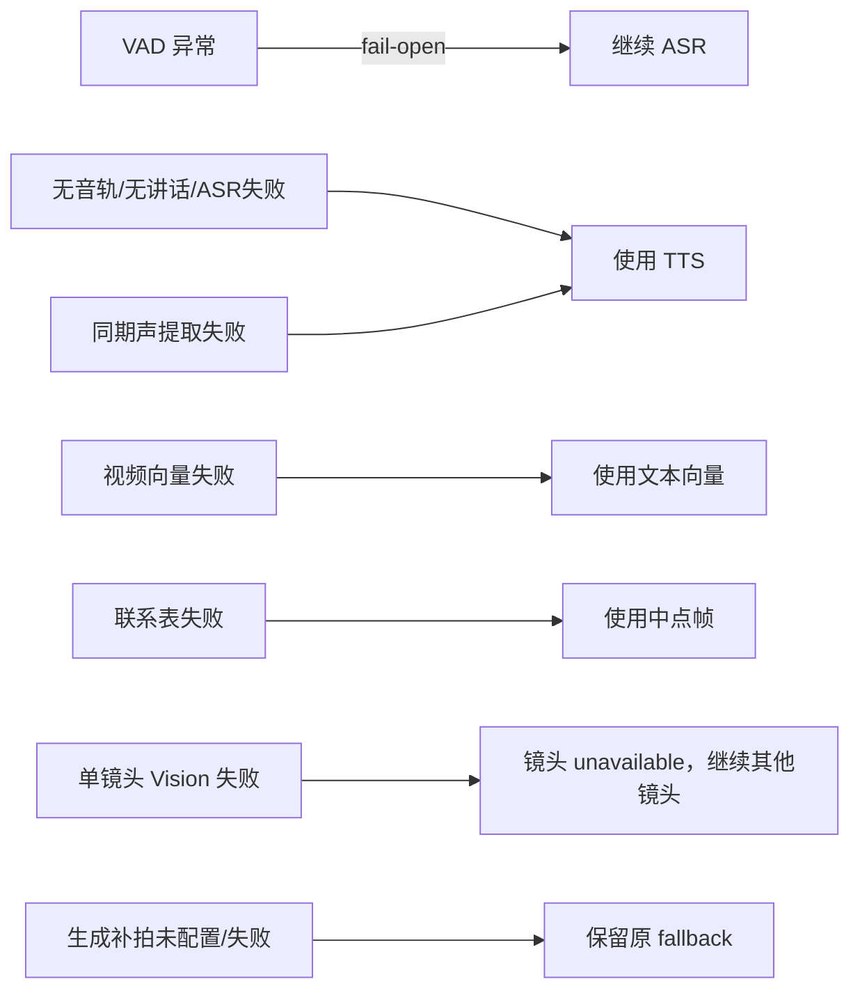
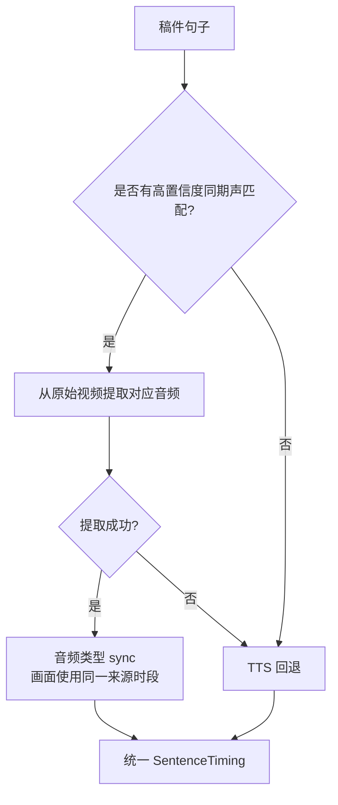
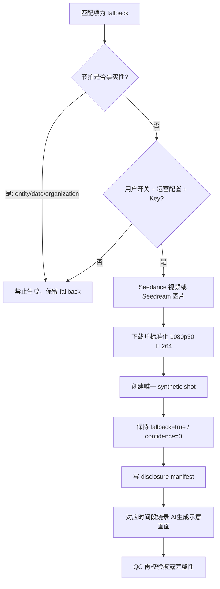
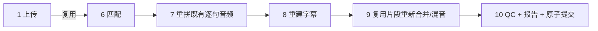
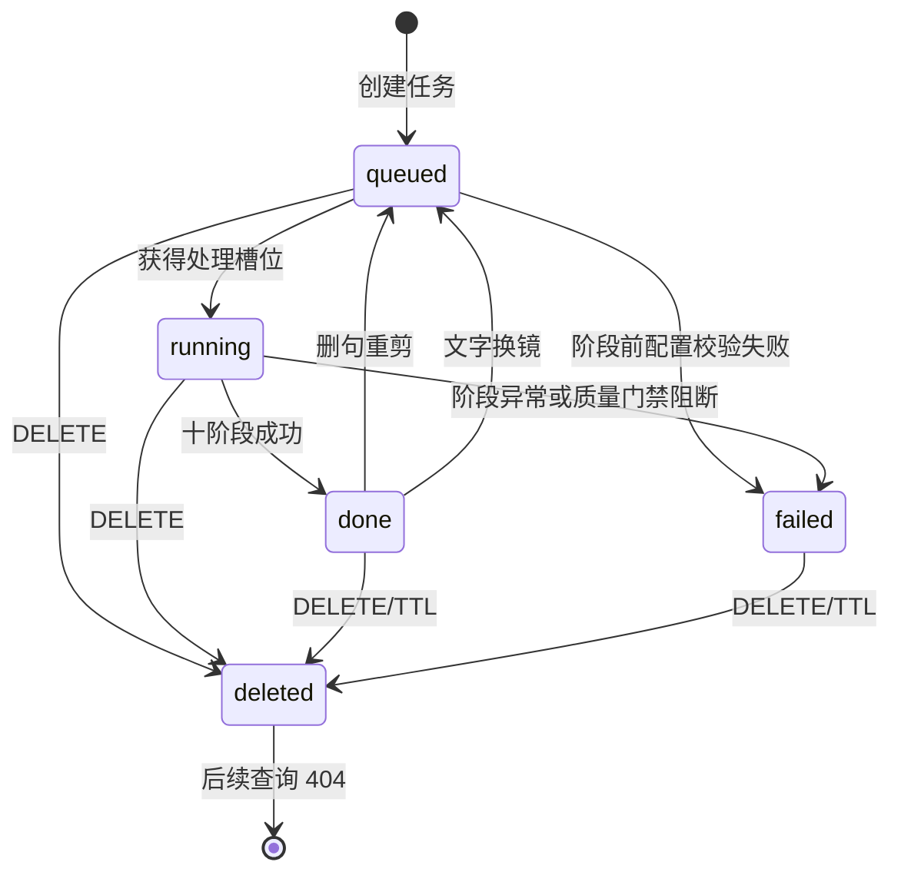

# Golden Mic 全功能、业务衔接与 UI/交互构建规格

> 面向：Claude Fable 5 或其他负责重新设计、实现前端界面的设计/开发模型  
> 基线日期：2026-09-07  
> 当前流水线实现版本：`2026.09.05.2`  
> 事实来源：当前后端、前端、测试、README、部署文档及 2026-09-05 本机真实 Provider 复测。若本文与旧审计文档冲突，以当前源码为准。

---

## 0. 如何使用本文

本文既是产品功能总览，也是前端实现约束。设计和构建 UI 时须区分四类信息：

- **[当前 API 可用]**：现有前端可以直接读取或调用，可以立即设计并实现。
- **[当前内部能力]**：后端流水线已经具备，但没有公开 API，不能在 UI 中伪造数据。
- **[可纯前端改进]**：不修改后端即可增强的体验。
- **[需新增后端]**：若希望展示或控制该能力，必须先扩展 API。

最重要的边界：本项目是**中文新闻稿驱动的自动新闻视频生成与句子级修订工具**，不是 Premiere、Resolve、剪映式的通用非线性编辑器。UI 应呈现“提交任务—自动生产—质量复核—句子级修订”的工作流，不应画出不存在的多轨时间线、关键帧编辑器或素材工程系统。

> ### 事实边界声明
>
> 1. **后端已有且公开 API 返回**：可以直接设计 UI 读取。
> 2. **后端已有但未公开返回**：不得猜测任务目录路径、扫描编号或用模拟数据伪装；只能记录为“需新增后端 API”。
> 3. **后端/API 已支持、当前 UI 尚未完整呈现**：可以纯前端实现，但不能描述成现有界面已经提供。
> 4. **设计建议或未来目标**：必须和当前运行事实分开。
>
> 当前公开报告只包含最终逐句结果和 QC 摘要，不包含完整候选集合、Embedding 分数、素材级 ASR、词级时间轴、EDL、音乐选择、生成披露清单或 provenance。QC 可做全片级生成媒体判断，但报告行没有可靠的 `media_origin` 字段。
>
> 访问模式由 `GET /api/session` 返回的 `access_mode` 决定。代码配置默认是 `authenticated`；无登录匿名模式只有在生产部署显式启用 `PUBLIC_ACCESS_MODE=anonymous` 并配置会话密钥后成立。开发模式则返回 `development`。
>
> `DELETE` 的实际语义是“取消并永久删除”。`cancelled` 是模型允许值和删除过程中的内部状态；删除成功后任务记录与文件消失，后续查询通常返回 404，而不是出现可重新打开的取消详情页。

### 0.1 Claude Fable 5 可实施边界速查

| 能力 | 后端/API | 当前 UI | 是否可直接实现 |
| --- | --- | --- | --- |
| 创建、状态、成片、逐句报告 | 已公开 | 已实现 | 可以重构 |
| QC metrics 仪表板 | 报告已返回 | 只展示计数/issues | 可纯前端补齐 |
| 音乐 mood 选择 | 创建模型已支持 | 固定发送 `auto` | 可纯前端增加控件 |
| 服务 ready/维护横幅 | 已有端点 | 未展示 | 可纯前端增加 |
| 逐句 AI 生成来源 | 报告无字段 | 无 | 不可；需后端字段 |
| 全镜头浏览器/contact sheet | 无列表 API | 无 | 不可；需后端 API |
| 完整候选评分解释 | 无公开字段 | 无 | 不可；需后端 API |
| EDL/词级时间轴编辑 | 无公开读写 API | 无 | 不可；需后端和产品模型 |
| Revision 列表/比较/回滚 | 无 | 无 | 不可；需后端版本系统 |
| 队列位置、ETA、额度余额、到期倒计时 | 无 | 无 | 不可；需后端字段 |
| 多轨时间线、关键帧、蒙版 | 无 | 无 | 不可；属于新产品内核 |

---

## 1. 产品定义

### 1.1 一句话定位

用户粘贴一篇中文新闻稿并上传若干原始视频，系统自动完成素材校验、同期声识别、视频规格化、镜头切分、多帧画面理解、稿件断句、语义选镜、新闻配音、字幕、音乐与图文包装、视频渲染及质量检查，最后输出可在线播放和下载的 1080p MP4；完成后还可按句删减或用文字指令更换某一句的画面。

### 1.2 核心输入

1. 一篇完整新闻稿。
2. 1 个或多个原始视频素材。
3. 一组可选剪辑偏好：节奏、基调、音乐、运动、首尾淡化、新闻图文、色彩一致性、生成式补拍和自由文字要求。

### 1.3 核心输出

1. 固定规格的成片：1920×1080、30fps、H.264、AAC 48kHz、MP4。
2. 逐句画面匹配报告。
3. 自动质量检查摘要与问题列表。
4. 每阶段进度和耗时。
5. 可继续产生的新 revision：删句重剪版或文字换镜版。

### 1.4 主要使用者

- 新闻编辑、政务或企业宣传人员。
- 拥有完整稿件和现场素材、希望快速自动成片的非专业剪辑用户。
- 负责部署、Provider 配额与质量门禁的运维人员；运维能力不是普通用户界面的主体。

### 1.5 明确不是

- 不是自由多轨时间线编辑器。
- 不是素材资产管理系统。
- 不是云端协作、账号或团队空间。
- 不是原生 iOS/Android App。
- 不提供手工字幕时间轴、音频工作站、关键帧、蒙版、画中画、专业调色、AI 抠像或多格式导出。

---

## 2. 完整功能地图

| 功能域 | 当前功能 | UI 中的核心入口 |
| --- | --- | --- |
| 安全会话 | 开发、代理认证、无登录匿名会话；匿名模式含签名 Cookie 与 CSRF | 页面启动时自动初始化，不显示技术细节 |
| 新建任务 | 新闻稿、批量视频、剪辑偏好提交 | 新建任务页 |
| 上传防护 | 后缀、MIME、文件数、单文件/总字节、请求体、磁盘预留 | 上传区、逐文件列表、错误提示 |
| 任务调度 | 排队、单机有限并发、全局待处理上限 | 处理页与历史状态点 |
| 十阶段生产 | 从上传校验到最终 QC/报告 | 处理页十阶段步骤器 |
| 同期声 | VAD、ASR、稿件匹配、命中后替换 TTS | 结果报告“同期声”标记 |
| 自动配音 | 数字读音规划、TTS、词级时间、语速与响度统一 | 偏好“节奏”；结果报告与 QC |
| 自动选镜 | 文本/OCR/实体/ASR/视频向量召回、LLM 精排、一镜一次 | 逐句匹配报告 |
| 生成式补拍 | 仅处理非事实性 fallback；强制 AI 披露；公开报告只有全片级生成指标 | 创建页开关、全片风险提示；逐句来源需新增字段 |
| 字幕 | 固定新闻模板、标题、正文、保护性整句布局、烧录 | 成片内，不提供独立编辑器 |
| 专业效果 | 音乐、旁白闪避、轻量运动、色彩一致、首尾淡化、新闻包装 | 创建页剪辑偏好 |
| 质量检查 | 匹配、实体、重复、定格、语速、响度、静音、披露等 | 结果页 QC 摘要和问题列表 |
| 在线预览 | 浏览器 MP4 播放，支持 HTTP Range | 结果页播放器 |
| 下载 | 当前 revision 的 MP4 | 结果页下载按钮 |
| 删除式重剪 | 勾选删除句子，复用阶段 1–6 和既有音视频 | 结果页匹配报告 |
| 文字换镜 | 选择一句，输入自然语言换镜要求 | 结果页换镜工具 |
| Revision | 初版为 0，每次重剪或换镜加 1 | 历史条目、处理页、结果页 |
| 浏览器历史 | 最多 100 条，保存任务 ID、Token、标题、状态与 revision | 左侧历史栏 |
| 取消与删除 | 取消运行并永久删除全部任务文件 | 处理页、历史条目 |
| 任务恢复 | 服务重启后恢复已完成记录；中断任务标记失败 | 历史重新打开 |
| 生命周期 | 可配置 TTL 自动清理 | UI 应提示历史可能过期 |
| 运维 | live、ready、drain、预检、单实例锁 | 非普通用户入口，可用于服务状态提示 |
| 发布部署 | Nginx/systemd、HTTPS、签名制品校验、前端 hash、字体/FFmpeg 检查、排空与回滚 | 运维流程，不进入普通用户工作台 |

---

## 3. 系统架构与数据边界



### 3.1 数据放置

- 服务端任务目录：`data/tasks/{task_id}/`。
- 完整原视频与中间产物保存在本地磁盘。
- 浏览器历史保存在当前浏览器 `localStorage`，键为 `golden-mic.history.v1`。
- 服务端只持久化任务 Token 的 SHA-256，不保存明文 Token。
- 浏览器必须保存创建响应中的明文 Token，否则刷新后无法再次访问该任务。
- 没有数据库、对象存储、服务端“我的任务列表”或跨设备同步。

### 3.2 会发送给第三方 Provider 的内容

UI 的隐私说明应准确告知：

- 当前配置的 Vision Provider：候选镜头的多帧联系表图片；当前默认是 Kimi K3。
- Seed ASR：从带音轨素材中提取的语音副本。
- Doubao Embedding Vision：文本以及阶段 6 粗召回后的候选视频代理。
- Kimi K3：阶段 5 的稿件上屏断句固定使用它。
- 当前配置的 LLM Provider：新闻稿、候选镜头文本证据、数字读音上下文、音乐分类和可选用户剪辑说明；当前默认也是 Kimi K3，但精排、数字读音和音乐分类可配置其他兼容 LLM。
- Seed TTS：需要配音的文稿内容。
- Seedance/Seedream：仅在双重开关满足时发送非事实性兜底节拍的生成提示词。

### 3.3 公开 API 能看到什么

**可直接展示：**

- 上传限制。
- 任务状态、十阶段状态、消息和耗时。
- 当前 revision。
- 成片。
- 每句匹配结果、缩略图、描述、时长、置信度、fallback、同期声、视觉节拍、换镜指令、文字叠层类型。
- QC 数量、指标字典和问题列表。

公开报告只返回最终选中镜头及有限视觉节拍字段，不返回完整候选集合、LLM alternates、Embedding 相似度、OCR/ASR/实体分项分数或实体复核证据。

**内部存在但当前不可直接展示：**

- 全部素材的 ASR 状态与全文。
- 全镜头浏览器及联系表。
- 所有候选镜头和各字段分数。
- 完整 EDL、词级时间轴、TTS profile、音乐选择、生成媒体清单和 provenance。
- 队列位置、剩余匿名额度、任务 TTL 到期时间。

如 UI 设计包含上述内部详情，必须标记为“需新增后端接口”，不能用模拟数据冒充线上能力。

---

## 4. 核心领域对象及关系



### 4.1 任务 `Task`

一个任务绑定一篇稿件、一组上传素材、一组偏好、一个任务 Token 和一个当前 revision。任务状态只能是：

- `queued`：已创建，等待并发槽位。
- `running`：正在处理。
- `done`：当前 revision 已成功完成。
- `failed`：当前处理失败。
- `cancelled`：模型允许的内部状态；公开 DELETE 成功后记录与文件通常已被移除，不能作为持久结果页依赖。

### 4.2 Revision

- 初版为 `revision=0`。
- 每次删句重剪或文字换镜，目标 revision 加 1。
- 服务端对外只保留“当前版本”的 `final.mp4` 与报告；revision 不是完整版本历史系统。
- URL 中的 `revision` 参数目前用于前端缓存失效，视频接口本身读取当前 `final.mp4`。
- 换镜有内部历史文件，但没有公开版本列表、比较、回滚或恢复 API。

### 4.3 播音单元与视觉节拍

- **播音单元 `Sentence`**：旁白、字幕、报告和删除式重剪的基本单位。
- **视觉节拍 `VisualBeat`**：一个播音单元内部可有 1–3 个画面意图，可对应多个镜头。
- 一个自然句可能被上屏断句为多个播音单元；这些单元可以共享 TTS group，保证连续播音。
- 视觉节拍的意图类型：`general`、`entity`、`organization`、`date`、`abstract`。
- 需要实体覆盖的节拍不能用无证据或 AI 生成画面冒充事实。

### 4.4 镜头

每个镜头具有来源素材、源场景序号、入出点、时长、缩略图、画面描述、主体、动作、关键词、OCR、实体、同期声文本、画质和可用状态。当前正常流水线以物理 `shot_id` 全局容量 1 进行最终节拍分配；不可行时失败，不通过重复源镜头或无限定格解决。QC 会再次检测重复，以拦截同期声、事实叠层、修订或旧产物造成的不一致。生成镜头也有唯一 ID，但不是原始实拍物理镜头。

### 4.5 EDL

EDL 是按播音单元组织的自动剪辑决策，每个 clip 记录：

- 镜头 ID。
- 本地视频来源。
- 源入点与出点。
- 可选定格补时。
- 是否按证据对齐入点。
- 来源是实拍 `source` 还是生成 `generated`。

EDL 是内部产物，不是用户可编辑的自由时间线。

---

## 5. 主用户旅程



### 5.1 首次进入

前端应并行调用：

1. `GET /api/session`：建立开发、认证或匿名会话。
2. `GET /api/config/limits`：获得动态上传和稿件限制。

会话初始化失败时，不应让用户在不知道写请求必然失败的情况下继续提交。可以保留页面内容，但主按钮应进入明确的“服务连接失败”状态并提供重试。

当前 Header 固定显示“无需登录”，但这只适合 development 或配置为 anonymous 的部署；`authenticated` 模式由反向代理先完成认证。新 UI 应保留 `/api/session` 返回的 `access_mode`，据此使用准确文案，而不是静态宣称所有部署均无需认证。现有 `initializeBrowserSession()` 丢弃了响应对象，若要显示该模式只需修改前端返回值，不需要新增后端接口。

### 5.2 创建任务

1. 用户填写稿件。
2. 添加文件，前端即时校验。
3. 设置偏好。
4. 点击“开始生成”。
5. 上传期间禁用重复提交；当前 `fetch` 实现只有等待态，没有字节级上传进度。
6. 收到 202 后立刻保存 `task_id` 和 `access_token`，再切到处理页。

### 5.3 完成后的决策

用户可：

- 播放当前成片。
- 下载当前成片。
- 阅读 QC 和逐句匹配证据。
- 勾选若干句子删除并提交重剪。
- 选择一句并用文字指令更换镜头。
- 新建空白任务。
- 从历史切换到其他任务。
- 永久删除当前或历史任务。

---

## 6. 应实现的页面和复合状态

当前应用是单路由 SPA，主视图为 `form`、`processing`、`result`。新 UI 可以重新组织布局，但必须完整覆盖下列状态。

### 6.1 应用外壳

#### 桌面端

- 左侧历史栏，主区域显示当前工作流。
- 历史栏应能滚动，活动任务明显高亮。
- 顶部展示产品名、当前任务标题/版本及简短产品定位。

#### 移动端

- 不应强制展示 1040px 宽表格作为主要交互。
- 历史改为抽屉、折叠区或独立列表视图。
- 逐句报告改为卡片，每张卡同时承载句子、缩略图、状态和操作。
- 所有主要触控目标至少 44×44 CSS px。

### 6.2 页面级状态清单

| 状态 | 必须展示 | 允许操作 |
| --- | --- | --- |
| 启动初始化 | 会话与服务限制加载状态 | 重试初始化 |
| 新建空表单 | 稿件、上传区、偏好 | 填写、选文件、提交、打开历史 |
| 表单含错误 | 字段或文件级错误，保留合法输入 | 修正、删除文件、重试 |
| 上传/创建中 | 明确“正在上传并创建任务”，防重复提交 | 可选：取消前端请求；不能声称已取消服务端未知任务 |
| 排队中 | `queued`、等待文案、0 或已有修订起点进度 | 取消并永久删除、打开其他历史 |
| 初版处理中 | 当前阶段、总进度、十阶段、耗时 | 取消并永久删除 |
| 重剪处理中 | revision、阶段 1–6 已复用、7–10 执行 | 取消并永久删除 |
| 换镜处理中 | revision、阶段 1–5/7–8 已复用、6/9/10 执行 | 取消并永久删除 |
| 失败 | 失败阶段、脱敏错误、已用时 | 返回表单；删除历史 |
| 取消/删除中 | 永久删除范围和进行中状态 | 不允许重复操作；成功后移除历史并回到表单 |
| 成功、报告加载中 | 视频入口与报告骨架 | 下载；等待报告 |
| 成功、报告失败 | 明确成片成功而报告失败 | 下载视频、重试报告 |
| 成功、完整结果 | 播放、下载、QC、逐句报告、修订工具 | 重剪、换镜、再做一个、删除 |
| 历史 Token 失效/已过期 | 统一的不可访问说明 | 保留或移除本地历史，不猜测任务是否存在 |
| 服务排空 | 暂停新建/重剪/换镜；状态与媒体读取仍可用 | 查看、播放、下载、永久删除；稍后重试修订 |

---

## 7. 页面规格

## 7.1 历史剪辑区

### 当前数据

每条本地历史记录包含：

```ts
{
  taskId: string;
  accessToken: string;
  title: string;
  createdAt: string;
  status: "queued" | "running" | "done" | "failed" | "cancelled";
  revision: number;
}
```

### 当前行为

- 最多保存 100 条。
- 标题来自规范化稿件的前 32 个字符，而不是服务端标题字段。
- 按创建时间倒序。
- 点击条目会重新查询状态；完成任务再加载报告。
- 删除按钮调用服务端删除；成功后才删除本地记录。
- 错误 Token、不存在、过期或被清理统一得到 404。

### UI 要求

每条至少显示：

- 截断标题。
- 状态标签和状态色。
- 创建时间。
- `v{revision}`，仅 revision 大于 0 时显示。
- 打开态和删除态。
- 删除的明确破坏性提示。

### 重要限制

- 没有服务端历史列表，因此新浏览器或清空 localStorage 后无法发现旧任务。
- 不要提供“同步历史”“跨设备恢复”或服务端搜索。
- 不要在视觉界面、分析埋点或普通日志中显示完整任务 Token。

## 7.2 新建任务页

### A. 新闻稿输入

- 必填。
- 提交前 `trim()` 后不能为空。
- 当前硬上限 8000 字；UI 应使用 `/api/config/limits`，不要只硬编码。
- 服务端允许换行、回车和 Tab，拒绝其他控制字符。
- 显示实时字符计数。
- 建议提示：第一行可被识别为标题；标题不会作为普通正文播报。
- 不要声称系统会从视频自动撰写稿件；用户必须提供完整稿件。

### B. 视频上传

支持：

- 点击选择。
- 多选。
- 拖放。
- 键盘 Enter/空格打开文件选择器。

允许扩展名：

- `.mp4`
- `.mov`
- `.avi`
- `.mkv`

前端需检查：

- 文件数。
- 单文件字节数。
- 全部文件总字节数。
- 扩展名。
- 同名且同大小的重复文件。

服务端还检查：

- MIME 白名单。
- 空文件。
- 文件名安全和最大长度。
- `Content-Length`。
- 实际读取字节数。
- 可用磁盘及任务级磁盘预留。
- 阶段 1 的 ffprobe 有效视频流检查。

**事实提醒：**配置中虽然存在源视频时长、分辨率和帧率上限，但当前阶段 1 调用只执行基础源媒体有效性检查，并未把这些可选上限传入；UI 不应在 `/api/config/limits` 未提供它们时展示为已强制执行的用户契约。

建议每个文件行显示：名称、大小、格式、验证状态和删除按钮；总量区域显示“已选 n / 上限”和容量进度。

### C. 剪辑偏好

#### 节奏 `pacing`

| UI 文案 | API 值 | 目标播报速度 |
| --- | --- | ---: |
| 沉稳 | `slow` | 230 字符/分钟 |
| 常规 | `normal` | 265 字符/分钟 |
| 紧凑 | `fast` | 290 字符/分钟 |

节奏会同时影响 TTS Provider 新闻语境、音频后处理和 QC，不等于直接把视频整体变速。

#### 基调 `tone`

| UI 文案 | API 值 | 作用 |
| --- | --- | --- |
| 庄重 | `solemn` | 自动音乐倾向庄重，包装使用对应强调色 |
| 中性 | `neutral` | 自动音乐倾向中性 |
| 明快 | `energetic` | 自动音乐倾向 uplifting，包装强调色更活跃 |

#### 背景音乐 `background_music`

- 使用本地授权音乐库。
- `music_mood=auto` 时优先由 LLM 识别稿件基调，失败时回退 `tone`。
- 音乐循环至旁白时长，首尾淡化，响度约 -32 LUFS，并通过侧链压缩避让旁白。
- `music_mood` 已存在于创建请求模型和 Pipeline 偏好中；当前 UI 固定发送 `auto`，新 UI 可直接增加“自动/庄重/中性/明快/紧张”选择，无需新增请求字段。它只影响后续选曲，当前报告并不返回实际曲目或分类证据。

#### 画面运动 `motion_effects`

- 为片段应用轻量 Ken Burns 缓慢推拉。
- 当前是每个片段总计约 8% 的固定缩放，不是智能摄像机运动或关键帧编辑器。

#### 片头片尾转场 `transitions`

- 只控制全片约 0.5 秒淡入和 0.6 秒淡出。
- 不包含镜头之间的溶解、擦除或转场库。

#### 新闻图文包装 `news_graphics`

- 全片左上角主题条。
- 末尾约 2.5 秒标题信息板。
- 强调色随基调变化。
- 片头标题由字幕标题样式承担，不重复叠加。

#### 色彩一致性 `color_consistency`

- 对各片段执行轻量曝光/饱和度统一。
- 不是专业调色、LUT、白平衡面板或 HDR 流程。

#### 生成式补拍 `generative_fill`

- 默认关闭。
- 只有运营开关、有效生成 Provider 配置和用户任务偏好同时满足才生效；普通 Vision、LLM 或 Embedding Key 并不代表生成能力可用。
- 仅处理已经判定为 fallback 的非事实性节拍。
- 人物、实体、机构和日期节拍不会用生成画面替代事实证据。
- 默认最多生成 2 个片段；时长、图片/视频模式、模型和 Provider 超时是运维配置，不是当前任务级参数。
- 会产生云费用和额外等待时间。
- 生成内容永久保持 fallback、置信度 0，并在成片内烧录“AI生成示意画面”。
- 在生产 `QUALITY_GATE_MODE=block` 下，fallback 本身仍是阻断问题，因此生成式示意画面不会被包装成已经通过事实质量门禁的素材。
- 稳定 UI 名称应为“生成式示意画面/补拍”，不要把模型名称固定成 Seedance 2.5，因为运营配置也可使用 Seedream 图片模式。
- 阶段 6 会在创建 Provider 和执行生成补拍前，先比较视觉节拍数与已有可用镜头数；因此该功能目前不能拯救“源镜头数量小于视觉节拍数量”的任务。UI 仍应提示用户上传足够多的不同画面素材。

#### 额外剪辑要求 `custom_instructions`

- 可选，最多 500 字。
- 去除首尾空白。
- 拒绝控制字符。
- 作为编辑简报参与阶段 6 LLM 精排；不能改变原稿、突破候选集合、实体约束或一镜一次约束。

### D. 默认值

后端在完全没有偏好时，所有增强项默认关闭；当前前端对新任务采用“专业处理默认开启”：

- `pacing=normal`
- `tone=neutral`
- `background_music=true`
- `music_mood=auto`
- `motion_effects=true`
- `transitions=true`
- `news_graphics=true`
- `color_consistency=true`
- `generative_fill=false`
- `custom_instructions=""`

**这是两个不同层次的默认值：后端缺省请求会关闭增强项，而当前前端新任务会开启音乐、运动、首尾淡化、新闻包装和色彩一致性。重做 UI 时必须显式发送完整 `preferences` JSON；省略该字段会静默回到后端默认，而不是当前 UI 默认。**

### E. 提交按钮

只有以下条件全部成立才可用：

- 稿件非空且不超限。
- 至少一个文件且文件数不超限。
- 每个文件不超单文件限制。
- 总字节数不超限。
- 当前没有正在提交。

当前接口没有创建幂等键。发生上传超时后直接重试可能创建重复、计费的任务；UI 应明确提示并避免自动重复提交。

## 7.3 处理页

### 顶部任务摘要

至少显示：

- 排队中、处理中、失败或取消状态。
- 当前 revision；revision 0 可显示“初版”。
- 当前阶段名称。
- 服务端 `message`，原样作为主要进度描述。
- 总进度百分比。
- 总处理耗时。
- “总耗时不含上传和排队”的说明。

不要根据百分比计算伪 ETA；当前 API 没有剩余时间或队列位置。

### 十阶段步骤器

每个阶段显示：

- 编号和名称。
- `pending / running / done / failed`。
- 阶段 `message`。
- 动态或最终 `elapsed_seconds`。
- 重剪/换镜时显示“本次复用”。

阶段进度是基于十阶段均分再叠加阶段内 fraction 的整数值，不代表各阶段真实工作量相同。

当前 API 没有结构化的 `reused` 字段；后端仅把复用说明写入阶段自然语言 `message`。现有前端甚至通过消息包含“复用已有产物”判断标签。新 UI 不应把某个完整中文句子当成长期稳定枚举；如需可靠复用状态，应新增后端字段。

### 轮询规则

- 进入处理页立即查询。
- 正常情况下每 1 秒查询一次。
- 失败后指数退避，最大 30 秒。
- 后台标签页至少 15 秒一次。
- 页面重新可见时立即查询。
- 同一页面只允许一个进行中的轮询请求。
- `done` 后停止状态轮询并加载报告。
- `failed/cancelled` 后停止轮询。

### 取消

唯一现有操作是“取消并永久删除”：

- 不是暂停。
- 不保留原始素材、中间产物、成片或报告。
- 必须有明确确认对话框。
- API 成功后才能删除本地历史。
- 404 时应保留本地历史并提示任务或 Token 已失效，避免误判服务端是否仍有遗留任务。

### 失败页

必须显示：

- `error_stage`。
- `error_message`。
- 已完成/失败阶段与耗时。
- 返回表单或新建任务入口。

同一标签页内，失败后返回表单可继续保留尚在 React 内存中的稿件、文件对象和偏好；从历史重新打开失败任务时，浏览器无法从服务端恢复原始 `File` 对象，因此不能承诺一键原样重试。

## 7.4 结果页

### A. 视频

- HTML5 MP4 播放器。
- `preload="metadata"`。
- 支持 Range 拖动。
- 播放失败时，仍提供下载入口。
- 视频 URL 必须带任务 Token；revision 用于缓存失效。
- 不把完整带 Token URL写入日志、分析事件或错误遥测。

### B. 结果摘要

显示：

- “成片已生成”。
- 当前 revision。
- 输出规格：1080p、30fps、H.264、MP4。
- 当前处理总耗时。
- 下载按钮。
- “再做一个”按钮；该操作应进入真正空白的新任务，并恢复既定前端默认偏好。

### C. 阶段耗时

- 总耗时。
- 十阶段各自耗时或“本次复用/未执行”。
- 初版显示“智能剪辑总耗时”；revision 大于 0 时显示“本次修订总耗时”。

### D. QC 摘要

必须显示：

- 阻断项数量。
- 警告数量。
- 问题列表。
- 问题关联的句子、视觉节拍或镜头（字段存在时）。
- 默认折叠长列表，但不能只以颜色传达严重程度。

建议利用当前 API 已返回的 `quality.metrics` 设计可折叠指标面板，例如：

- 播音单元数和视觉节拍数。
- 唯一镜头数、最大镜头使用次数。
- fallback 数和比例。
- 低置信度数。
- 实体覆盖率。
- 词级时间覆盖率。
- 多节拍/多镜头句数。
- 语速均值、最小值、最大值和异常数。
- 音色 profile 与 TTS session 数。
- 逐句响度跨度。
- 成片时长、静音时长、综合 LUFS、True Peak。
- 定格数量、总时长和最大时长。
- 生成镜头数与披露完整性。

生成披露的当前全片级字段名为：`generated_media_clip_count`、`generated_media_disclosed_shot_count`、`generated_media_disclosure_complete`。它们不提供逐句映射。`quality.metrics` 已可通过报告 API 读取，但现有前端尚未完整渲染这个指标面板，因此这是“API 已支持、前端待实现”。

注意 `error` 是质量阻断级，不一定意味着任务状态失败：开发 `warn` 模式会发布带阻断项的成片；生产 `block` 模式会在完成前失败。

### E. 逐句匹配报告

每一行/卡片须支持以下字段：

- 原始句子文本。
- 句子序号。
- 主要镜头缩略图。
- 镜头 ID。
- 画面描述。
- 播放时长。
- 置信度百分比。
- `is_fallback`。
- 音频类型：`tts` 或 `sync`。
- 同期声实际识别文本；仅在与稿件不同且 `audio_kind=sync` 时重点显示。
- 多视觉节拍列表：节拍文本、镜头、描述、置信度、是否要求实体覆盖。
- 最近一次换镜指令。
- 事实文字叠层类型：日期、机构或抽象总结。
- 事实文字叠层原文。

建议的语义徽章：

- “同期声”——绿色。
- “AI 配音”——中性。
- “低置信度”——黄色，低于 0.5。
- “兜底画面”——错误/警告色。
- “事实文字叠层”——明确说明相关环境画面不代表直接视觉证明。
- “AI 生成示意画面”——必须显著且不可隐藏；但当前公开报告只能通过 QC metrics 做全片级存在性/完整性提示，行级没有 `media_origin`。如需把徽章可靠绑定到某句或某节拍，必须扩展报告 API。绝不能通过 `is_fallback` 猜测，因为 fallback 也可能是实拍兜底。

本节是新 UI 的目标展示契约，不代表现有前端已完整呈现所有字段。现有界面已显示基础逐句结果、同期声、fallback、低置信度、换镜指令、文字叠层和 QC issues；完整 metrics 面板、实体覆盖说明与逐句生成来源仍未完整实现。

### F. 报告失败降级

若任务已 `done` 但报告加载失败：

- 明确写“成片已生成，报告暂时无法加载”。
- 保留下载按钮。
- 提供“重试加载报告”。
- 不把它显示成视频生产失败。
- “重试”只重新调用 `GET /api/tasks/{id}/report`，不会重新运行 QC 或重新生成报告；当前没有“重新生成报告”API。

---

## 8. 十阶段流水线详解与衔接

| 阶段 | 输入 | 关键处理 | 输出/后续依赖 | 失败与降级 | 用户可见信息 |
| ---: | --- | --- | --- | --- | --- |
| 1 上传校验 | 原稿、上传文件记录 | 路径隔离、存在/大小复核、ffprobe、有效视频流 | `upload_manifest.json`；原始视频进入阶段 2 | 无效视频、空文件、路径异常直接失败 | `上传校验 n/m`、失败文件原因 |
| 2 同期声识别与本地格式适配 | 原视频 | ASR 与规格化并行；有音轨则抽 16kHz 单声道 WAV；Silero VAD；ASR 缓存/稀疏重试；视频统一 1080p30 H.264 无音轨 | `asr_transcripts.json`、`asr/`、`norm/`；阶段 3 用 norm，阶段 4/6/7 用 ASR | 无音轨/无讲话/单素材 ASR 失败均降级；VAD 异常 fail-open；规格化失败则失败 | ASR 可用数、VAD 跳过数、格式化文件数 |
| 3 镜头切分 | 规格化视频 | PySceneDetect；丢弃短于 1 秒镜头；超 `MAX_SHOTS` 时按时长均匀采样 | `shots.json`；阶段 4 逐镜头分析 | 无有效镜头失败 | 已发现/保留镜头数 |
| 4 画面理解 | 镜头、ASR | 中点缩略图；5 帧联系表；Kimi Vision 提取描述、场景、主体、动作、关键词、OCR、实体、画质；融合对应时间 ASR | `shots_annotated.json`、缩略图、联系表；阶段 6 的检索语料 | 联系表失败回退中点帧；单镜头失败标不可用；全部失败则任务失败 | `画面理解 n/m`、可用镜头数 |
| 5 文稿分句 | 原新闻稿 | Kimi K3 仅插入 ` / `；逐字保真验证；危险断点合并；标题识别；播音单元、自然句组和 1–3 个视觉节拍 | `script_segmented.txt`、`script_structure.json`、`sentences.json`；阶段 6/7/8 共用 | 模型改写原文、空单元、过多句子等失败 | 播音单元数、视觉节拍数、是否识别标题 |
| 6 语义匹配 | 句子/节拍、标注镜头、ASR | 先检查视觉节拍数不超过可用唯一镜头数；文本向量、字段词法、OCR/实体/ASR/action、候选视频向量、实体复核、LLM 精排、多样性、全局一对一分配；可选生成补拍；同期声匹配 | `match_plan.json`、视频向量和指标、实体复核、可选生成披露；阶段 7/9 使用 | 视频向量失败回退文本；同期声匹配整体异常回退 TTS；不可行唯一分配失败；生成未配置保留 fallback | 匹配进度、同期声句数、fallback 数 |
| 7 配音与同期声 | 播音单元、匹配计划 | 全文数字读音；连续 TTS；安全音频切分；同期声提取或回退 TTS；语速调整、逐句响度统一、拼接 | `pronunciation_plan.json`、`timings.json`、`tts_manifest.json`、`narration_profile.json`、`narration.m4a`；阶段 8/9/10 使用 | 同期声提取失败回退 TTS；TTS 失败则阶段失败 | `配音合成/同期声提取 n/m`、同期声替换数 |
| 8 字幕生成 | 时间轴、词时、标题 | 固定 ASS 新闻模板；简体化、标点处理、15 字单行或保护性整句；与声音边界对齐；哈希清单 | `subs.ass`、`subtitle_manifest.json`；阶段 9 烧录，阶段 10校验 | 时间重叠、无法排版、模板/字体问题失败 | 字幕事件数 |
| 9 视频渲染 | timings、match plan、shots、偏好 | 事实信息叠层镜头分配；构建 EDL；按词时切换视觉节拍；裁切/定格；色彩、运动；片段拼接；音乐、字幕、图形、淡化；成片规格验证 | `edl.json`、`segments/`、`segment_manifest.json`、`video_only.mp4`、`final.mp4`、可选音乐/图形文件 | 重复镜头、非法时长、字幕校验、FFmpeg 或规格失败 | 片段 n/m、合并、混音、烧录、规格校验 |
| 10 完成 | 全部产物与 final | 建立重剪源快照；同步转后台线程做 QC；质量门禁；生成报告；必需产物完整性检查 | `source_timings.json`、`source_edl.json`、`quality_report.json`、`report.json`；任务 `done` | block 模式有 error 则失败；缺产物失败；warn 模式发布并显示问题 | 阻断项/警告数、报告行数、完成 |

### 8.1 初版产物依赖



### 8.2 关键降级链



不存在的降级：

- 所有 Vision 失败不会继续。
- 唯一镜头分配不可行不会自动重复镜头。
- 素材数量不足不会通过无限定格解决；定格只延长已分配镜头的持续时间。
- 字幕清单被篡改不会静默继续渲染。
- 媒体 QC 无法测量不会默认当成通过。

---

## 9. 关键子系统逻辑

## 9.1 标题、断句与视觉节拍

1. 第一条非空行若不超过 40 字、没有句末标点，且后接空行或下一行明显更像正文，可识别为标题。
2. 标题用于片头标题和新闻包装，不进入正文 TTS。
3. Kimi K3 只被允许在原稿中插入分隔符；系统重建并验证删除分隔符后与原稿逐字一致。
4. CRLF、原标题空格和原文字符必须保留。
5. 不在主谓、动宾或无韵律停顿处强行切播音单元；危险断点会被合并。
6. 长句可保持一个播音单元，但产生多个视觉节拍，从而让旁白连续、画面可切换。
7. 枚举、日期、地址、引用和实体具有专门保护/意图识别。

## 9.2 语义选镜与“一镜一次”

匹配不是只看一个相似度。它组合：

- 镜头描述向量。
- Query/Corpus 区分的文本 Embedding。
- OCR。
- 实体。
- 同期声 ASR。
- 动作。
- 词法救援。
- 候选级视频向量。
- 最多有限数量的实体视觉二次复核。
- LLM 精排。
- 全局一对一资源分配。

所有视觉节拍最终必须获得不同的物理镜头。这个约束贯穿：匹配、同期声替换、事实叠层、EDL、换镜、重剪和 QC。

## 9.3 同期声与 TTS 的互斥



- 同期声和 TTS 不会同时播放。
- 同期声匹配要求向量相似度和文字重合度同时达到配置阈值。
- 选择同期声后，画面强制绑定该声音所在镜头和时间段。
- 报告中的 `spoken_text` 用于展示实际识别文本。

## 9.4 TTS 数字读音与连续性

- 有阿拉伯数字时，LLM 一次性结合全文规划读法。
- 字幕/报告保留原文，只有送给 TTS 的文本被替换。
- 同一自然句即使拆成多个播音单元，也尽量只调用一次支持词时间戳的 TTS，再安全切分。
- 词时间用于字幕和画面切点提示，不作为自然句尾的硬声学裁点；末段保留到实际音频尾部以避免末字截断。
- 全片统一音色 profile、目标语速、48kHz 与响度标准。

## 9.5 字幕

固定模板 `GM-NEWS-DIALOGUE-2024-001`：

- Noto Sans SC。
- 画面中心 80% 安全区。
- 底部 10% 对白区。
- 普通对白白色粗体、黑色描边阴影。
- 普通事件最多 15 字一行。
- 需要保护的长句使用稳定整句样式：每行最多 30 字、最多两行。
- 仅保留书名号，其余标点转为空格停顿。
- NFKC、繁体转简体。
- 自然句之间至少 80ms；同一连续 TTS group 的内部边界可为 0。
- 标题最多两行、每行 20 字，默认展示 4 秒。
- ASS 文件、模板参数、布局和 SHA-256 绑定；篡改会阻止渲染。

UI 不应提供字体、颜色、位置、动画和时间码编辑控件，因为后端没有相应请求模型。

## 9.6 渲染与画面长度

- 正常镜头优先覆盖整个句子或节拍。
- 优先避免短于 1.5 秒的补片段。
- 镜头不足以覆盖已分配时长时，复制最后一帧定格补齐。
- 定格超过 0.3 秒会成为 QC error。
- 视觉片段超过 6.5 秒会产生 warning。
- 多视觉节拍优先按 TTS 词起点切镜；无法对齐时按文字权重比例分配。

## 9.7 事实文字叠层

日期、机构或抽象总结在缺少直接视觉证据时，可以：

1. 从上传的真实素材中选择与整篇/自然句语境相关的环境画面。
2. 在画面上叠加事实文字。
3. 保留“这不是直接视觉证明”的 QC warning。
4. 不允许使用 AI 生成画面作为事实叠层底图。

报告用 `overlay_kind` 和 `overlay_text` 暴露该状态。

## 9.8 生成式补拍与披露



必须在 UI 文案中始终使用“生成式示意画面/补拍”，不能使用“真实现场补全”或“事实画面”。

## 9.9 质量门禁

下列是当前已实现或已验证的代表性 QC 项，不是完整的专业视频质量标准。当前 QC 未公开提供镜头切点亮度/光流连续性、字幕视觉遮挡、opening/body/closing 角色编排、Ken Burns 速度或所有画面级感知质量门禁；这些属于后续后端增强，UI 不得声称已经自动检查。

### Error 级典型问题

- 重复使用物理镜头。
- 使用无语义保证的 fallback。
- 明确实体没有画面证据。
- 标题被当正文播报。
- TTS 语速超出目标区间。
- 同一成片存在多套音色 profile。
- 成片媒体质量无法测量。
- 定格超过 0.3 秒。
- AI 生成媒体缺少披露。

### Warning 级典型问题

- 短间隔重复镜头。
- 低于配置阈值的匹配置信度。
- 事实文字使用上下文 B-roll。
- 多节拍仍使用一个镜头。
- 句间停顿过长。
- 多个 TTS session，可能存在韵律漂移。
- 逐句响度跨度过大。
- 视觉片段过长。
- 静音比例、全片响度或 True Peak 偏离目标。

### UI 解释原则

- `blocking_issue_count` 表示质量语义，不等同于 HTTP 错误。
- `warn` 模式可能完成并展示 error 级问题。
- `block` 模式在有 error 时任务直接失败，通常不会进入完整结果页。
- `MATCH_FALLBACK` 本身是 error；生成式补拍不会清除 fallback error，只增加经过披露的示意画面。披露缺失会再产生独立 error。
- 不允许用一个笼统“AI 评分”替代问题级解释。

---

## 10. 删除式重剪

### 10.1 用户操作

1. 在报告中勾选“删除”句子。
2. UI 实时显示已选删除数量。
3. 至少保留一句；删除全部时禁用提交并解释原因。
4. 提交 `keep_sentence_ids`，不是 `delete_sentence_ids`。
5. 服务端按原始句子顺序过滤，用户不能重排。

### 10.2 阶段复用



- 阶段 1–6：标记“复用已有产物”。
- 阶段 7：不调用 TTS/ASR，只重拼已有逐句音频。
- 阶段 8：按新时间轴重建字幕。
- 阶段 9：复用已有视频 segment，不重新切片；仍重新合并、混音和烧录。
- 阶段 10：重新 QC 和生成报告。
- 目标是 30 秒内，但不是 SLA；机器负载和成片长度会影响时间。

### 10.3 数据安全

- `source_timings.json` 和 `source_edl.json` 是初版不可变基线。
- `timings.json`、`edl.json`、`final.mp4`、报告和 QC 表示当前 revision；当前没有公开可回滚的版本目录。
- 所有重剪产物先写临时文件。
- 提交时逐项备份和原子替换；失败会回滚已替换文件。
- AI 披露清单按当前 EDL 过滤。
- 当前公共成片被新 revision 覆盖，没有用户可见的版本回滚。

上述回滚保证针对正常 Python/FFmpeg 异常路径。进程崩溃、主机断电或文件系统故障下，当前没有 durable transaction journal 或 revision-directory pointer，不能承诺整组产物在任意崩溃时刻都具备事务一致性。

---

## 11. 逐句文字换镜

### 11.1 用户操作

1. 选择当前报告中的一句。
2. 输入 1–500 字自然语言指令。
3. 控制字符不允许。
4. Enter 可提交，但在多行设计中应避免与换行冲突；当前实现使用单行 input。
5. UI 明确说明“只改画面，保留该句旁白和字幕”。

### 11.2 处理逻辑

- 复用阶段 1–5、7–8。
- 阶段 6：把用户指令作为目标视觉查询，重新执行目标句的检索和精排；复用已有 Vision/OCR/ASR 标注，不启用视频 Embedding，并继续传入任务级 `custom_instructions` 作为全局编辑简报。
- 排除：该句当前镜头、其他句当前占用镜头、当前 EDL 占用镜头以及同一句历史换镜使用过的镜头。
- 生成式镜头不进入可选换镜池。
- 阶段 9：只重渲染目标句，其他句复用既有 segments；然后重新合并、混音和烧录。
- 阶段 10：重新 QC、报告和原子提交。
- 同期声匹配会被移除，换镜后的目标句使用原有旁白时间轴而不是重新绑定另一段同期声。

### 11.3 失败条件

- 当前任务不是 `done`。
- 目标句不存在于当前 revision。
- 没有不同于当前画面的可用、未占用实拍镜头。
- 新结果造成重复镜头。
- 当前 match plan、timings、EDL 或 segment manifest 不一致。
- 渲染、QC 或原子提交失败。

UI 不应承诺每次换镜都能成功；素材池有限且一镜一次。

---

## 12. API 契约

### 12.1 通用鉴权规则

- 普通 JSON/状态 API：任务 Token 放入 `X-Task-Token`。
- `<video>` 与 ``：任务 Token 放入 `token` 查询参数。
- 所有 `fetch` 使用 `credentials: include`，以携带匿名会话 Cookie。
- 匿名生产模式的 POST/DELETE 还要携带 `X-CSRF-Token`。
- 收到带 `X-Anonymous-Session: required` 的 403 时，前端重新请求 `/api/session`，只自动重试一次原写请求。
- 缺少 Token、Token 错误和任务不存在统一返回 404。
- `/api/config/limits` 不需要任务 Token，但仍处于生产访问模式、Host 与相关中间件边界内，不是绕过生产入口的无条件开放数据。

### 12.2 端点表

| 方法 | 路径 | 请求 | 成功 | 主要 UI 用途 |
| --- | --- | --- | --- | --- |
| GET | `/health/live` | 无 | `{"status":"live"}` | 可选服务状态 |
| GET | `/health/ready` | 无任务 Token | 200 ready 或 503 not_ready | 可选服务就绪提示；部署层可限制公网访问 |
| GET | `/api/session` | Cookie | access mode、CSRF、过期时间 | 页面启动 |
| GET | `/api/config/limits` | 无 | 文件/字节/稿件限制 | 动态表单约束 |
| POST | `/api/tasks` | multipart：`script`、`files[]`、`preferences` JSON | 202 + task ID + Token | 创建任务 |
| GET | `/api/tasks/{id}` | `X-Task-Token` | 任务、阶段、耗时、revision | 轮询与历史恢复 |
| GET | `/api/tasks/{id}/report` | `X-Task-Token` | 逐句报告 + QC | 结果页 |
| GET | `/api/tasks/{id}/video?token=...` | Query Token | MP4 / Range | 播放和下载 |
| GET | `/api/tasks/{id}/thumbs/{shot}.jpg?token=...` | Query Token | JPEG | 报告缩略图 |
| POST | `/api/tasks/{id}/remix` | `{keep_sentence_ids}` | 202 + revision | 删句重剪 |
| POST | `/api/tasks/{id}/replace-shot` | `{sentence_id,instruction}` | 202 + revision | 文字换镜 |
| DELETE | `/api/tasks/{id}` | `X-Task-Token` | 204 | 取消并永久删除 |
| GET/POST/DELETE | `/api/admin/drain` | 仅 loopback | 运维快照 | 不进入普通用户 UI |

本表只描述公开路由，不代表内部 artifact 的完整序列化。字段以当前 Pydantic response model 为准；报告尤其不返回完整 EDL、候选分数、素材级 ASR、词级时间、音乐选择、生成披露清单或 provenance。缩略图接口也没有列举/分页能力，不能通过猜测 shot ID 实现全镜头浏览器。

### 12.3 创建响应

```json
{
  "task_id": "32位十六进制字符串",
  "access_token": "只在创建时返回的随机凭据"
}
```

前端必须先持久化这两个值，再进入处理页。

### 12.4 状态响应

```json
{
  "task_id": "...",
  "status": "running",
  "current_stage": 6,
  "stage_name": "语义匹配",
  "progress": 54,
  "message": "正在进行批量向量检索与精排",
  "error_stage": null,
  "error_message": null,
  "revision": 0,
  "processing_started_at": "ISO-8601 or null",
  "processing_completed_at": null,
  "total_elapsed_seconds": 42.317,
  "stages": []
}
```

### 12.5 报告响应

```json
{
  "task_id": "...",
  "rows": [
    {
      "sentence_id": 0,
      "sentence": "...",
      "shot_id": 12,
      "thumb_url": "/api/tasks/.../thumbs/12.jpg",
      "description": "...",
      "duration": 4.2,
      "confidence": 0.87,
      "is_fallback": false,
      "audio_kind": "tts",
      "spoken_text": null,
      "visual_beats": [],
      "replacement_instruction": null,
      "overlay_kind": null,
      "overlay_text": null
    }
  ],
  "quality": {
    "blocking_issue_count": 0,
    "warning_count": 2,
    "metrics": {},
    "issues": []
  }
}
```

### 12.6 HTTP 错误处理矩阵

| 状态 | 典型原因 | UI 行为 |
| ---: | --- | --- |
| 400 | 表单、文件、重剪选择、换镜指令或产物状态非法 | 显示服务端具体中文 `detail`，关联到当前操作 |
| 401 | 生产代理身份缺失 | 显示访问认证异常；不要反复自动重试 |
| 403 | Origin/CSRF/匿名会话无效 | 若带会话失效头，刷新会话并重试一次；否则提示来源不受信任 |
| 404 | 任务不存在、Token 错误、已过期、报告/视频/缩略图未生成 | 按场景文案处理；不能断言是哪一种安全原因 |
| 409 | 当前任务不满足修订前置条件，通常是非 `done`、已有修订在排队/运行或状态发生冲突 | 先刷新状态并让用户重新确认，避免自动重复提交 |
| 411 | 上传没有 `Content-Length` | 提示浏览器/代理上传配置异常 |
| 413 | 请求体、单文件或总文件超限 | 保留表单，定位容量问题 |
| 422 | JSON schema 错误 | 展示字段校验消息，不清空用户输入 |
| 429 | 会话/IP/用户/全站小时配额 | 尊重 `Retry-After`；显示限流而非普通网络错误 |
| 503 | 队列满、服务排空或暂时不可用 | 保留输入；提示稍后重试；读取类结果仍可尝试 |
| 507 | 数据盘空间不足 | 明确为服务容量问题，不建议用户重复上传 |
| 网络/超时 | 服务不可达或浏览器中断 | 保留所有输入；安全地允许人工重试 |

当前 `api.ts` 会把所有 429 简化成“当前请求过多”，把所有 5xx 简化成通用文案。重新实现时可保留安全性，同时利用 `Retry-After` 做更准确的等待提示。

---

## 13. 状态、并发与恢复规则

### 13.1 任务状态机



- `processing_started_at` 在获得 semaphore 后设置，因此不含排队。
- 运行中的阶段耗时由状态 API 动态计算。
- 重剪和换镜会重置本次耗时。
- 后端没有暂停、恢复、重试当前阶段的 API。
- `cancelled` 仍是内部模型状态，但公开取消成功后资源随即删除；UI 不应设计可持久访问的 cancelled 详情页。

### 13.2 队列

- 开发默认最多同时处理 2 个任务、最多 20 个 queued+running。
- 生产首次部署要求 1 个处理任务、最多 5 个待处理任务。
- UI 没有队列位置数据，只能显示“排队中”。
- 队列和 rate limit 都在进程内存中。

### 13.3 服务重启

- `done` 且 `final.mp4`、`report.json` 完整：恢复可访问。
- `queued/running`：恢复为 `failed`，文案为服务重启中断。
- `done` 但关键产物缺失：恢复为失败。
- 不提供断点续跑。

### 13.4 TTL

- 开发可配置为 0，即不自动清理。
- 生产必须大于 0；部署模板通常为 72 小时。
- 只清理终态任务；运行和排队任务不按 TTL 删除。
- 当前 API 不返回到期时间。UI 若显示具体倒计时，需要新增字段；否则只能显示一般性提醒。

### 13.5 排空

- drain 时拒绝创建、重剪和换镜。
- 状态、报告、视频和缩略图仍可读取，任务删除仍可执行；删除属于允许的破坏性维护动作，不是读取。
- readiness 返回 503 和 `service_draining`。
- 普通用户 UI 无须提供 drain 控件；可通过 ready 状态显示“服务当前未就绪”，并在错误确为 `service_draining` 时显示“维护中，暂不接受新任务”。

`/health/ready` 返回 503 不只表示 drain，也可能表示启动预检失败、数据盘不可用或磁盘安全余量不足；启动预检本身还检查前端制品、字体、FFmpeg 能力和 Provider 配置。UI 若读取 `errors`，应显示“服务未就绪”的具体安全文案，而不是把所有情况统一称为维护。

---

## 14. 安全、隐私与费用提示

### 14.1 任务访问 Token

- Token 是任务级访问凭据，不是装饰性 ID。
- 所有任务读写必须保留 Token。
- 视频/缩略图 Token 在 URL 中，所以：
  - 不发送到第三方统计服务。
  - 不显示完整 URL。
  - 不使用外部图片代理。
  - 不在错误追踪中采集查询字符串。

### 14.2 浏览器会话

匿名生产模式无需登录，但不是无保护：

- 签名 HttpOnly Cookie。
- SameSite Strict。
- 写请求 CSRF。
- Origin 校验。
- 每会话/IP/全站额度。
- 每任务独立 Token。

UI 不需要显示登录页，也不能声称存在账户体系。

### 14.3 CSP 对 UI 构建的影响

生产 CSP 只允许同源资源：

- 脚本、图片、媒体、连接、字体应来自自身部署。
- 不要依赖 Google Fonts、CDN 脚本、外链图标或远程设计资源。
- 图标应继续打包，例如现有 `lucide-react`。
- 预览和缩略图必须使用同源 API。

### 14.4 生成式费用

生成式补拍是显式 opt-in，UI 至少要提示：

- 可能产生额外云费用。
- 只在 fallback 时尝试，不保证一定触发。
- 最多片段数由服务端配置。
- 生成失败会保留原 fallback。
- 生成画面会强制披露，不能关闭水印式文字声明。

### 14.5 数据保留

- 任务文件在本地服务端磁盘。
- 浏览器历史只在当前浏览器。
- 生产任务会按 TTL 删除。
- 用户主动删除会永久删除整套任务文件。
- UI 必须在删除确认中列出：原始素材、中间产物、成片和报告。

---

## 15. 当前视觉系统与建议设计方向

### 15.1 当前 Token

| Token | 值 | 当前语义 |
| --- | --- | --- |
| `ink` | `#172033` | 主文字 |
| `paper` | `#f6f4ef` | 页面底色 |
| `line` | `#d8d2c5` | 边框 |
| `signal` | `#b42318` | 主行动、错误、风险 |
| `steel` | `#23536f` | 次主色、进度、链接 |
| `panel shadow` | `0 18px 60px rgba(23,32,51,.12)` | 卡片层级 |

字体栈：Noto Sans SC、Source Han Sans SC、Microsoft YaHei、sans-serif。

### 15.2 设计方向

建议定位为“现代新闻编辑台”，而不是消费级花哨视频模板站：

- 高信息密度但层次清楚。
- 以深蓝/钢蓝表示处理中和可信系统动作。
- 以红色只表示主要提交或高风险操作，不要把普通状态都染红。
- 绿色表示成功或同期声命中。
- 黄色表示需人工复核。
- AI 生成内容使用独立、持续一致的显著徽章。
- 数值采用 tabular numerals，尤其是进度、耗时、置信度和版本号。
- 桌面优先适配长稿、批量素材和报告复核；移动端保留创建、进度、预览、删除式重剪和换镜，不仿造桌面表格。

### 15.3 推荐组件层级

```text
AppShell
├─ GlobalHeader
│  ├─ ProductIdentity
│  ├─ CurrentTaskSummary
│  └─ OptionalServiceHealth
├─ HistoryNavigation
│  ├─ NewTaskButton
│  ├─ HistoryFilter (纯前端可选)
│  └─ HistoryTaskItem[]
└─ Workspace
   ├─ NewTaskWorkspace
   │  ├─ ScriptEditor
   │  ├─ UploadDropzone
   │  ├─ SelectedAssetList
   │  ├─ EditingPreferences
   │  └─ SubmitBar
   ├─ ProcessingWorkspace
   │  ├─ TaskProgressHero
   │  ├─ StageStepper
   │  └─ DestructiveCancelDialog
   ├─ FailureWorkspace
   ├─ ReportUnavailableWorkspace
   └─ ResultWorkspace
      ├─ VideoPlayer
      ├─ OutputActions
      ├─ TimingPanel
      ├─ QualityPanel
      ├─ RevisionActions
      └─ SentenceMatchList/Table
```

### 15.4 反馈形式

- 表单校验：字段内联，不应只用一个全局字符串。
- 创建/重剪/换镜：按钮内 loading + 页面级状态。
- 非阻断通知：`aria-live="polite"`。
- 错误：`role="alert"`，并把焦点移动到错误摘要。
- 删除/取消：自定义可访问对话框；默认焦点放在安全的取消按钮。
- 操作成功：不要仅 Toast；任务状态和历史条目必须同步更新。

---

## 16. 响应式与无障碍要求

### 16.1 必须保留

- HTML `lang="zh-CN"`。
- 所有表单 label 与控件程序化关联。
- 进度条的 `role=progressbar` 与 `aria-valuenow/min/max`。
- 状态变化的 live region。
- 图片有描述性 alt，失败时有文字占位。
- 报告桌面表格有 caption 和 scope；移动端则用语义列表/卡片。
- 上传区支持键盘和拖放。
- 开关、单选组、展开区完整暴露 checked/pressed/expanded 状态。
- 不依赖颜色单独表达状态。
- `focus-visible` 清晰可见。
- 支持 200% 缩放，无关键操作被裁切。
- 尊重 `prefers-reduced-motion`；不要让加载动画或过渡成为阅读障碍。

### 16.2 移动端建议

- 历史栏改为抽屉。
- 表单先稿件、再素材、再偏好、最后固定提交栏。
- 文件列表支持折叠与总量摘要。
- 十阶段为垂直步骤器。
- 结果报告每句一张卡；“删除”和“换镜”不要依赖横向滚动表格。
- 视频播放器保持 16:9。
- 危险操作与普通主按钮保持足够间距。

---

## 17. 前端异步与竞态规则

1. **创建防重入**：提交后立即禁用；没有幂等键，不自动重发上传。
2. **轮询单飞**：同一任务同时只能有一个状态请求。
3. **视图切换隔离**：打开另一历史任务后，旧任务响应不得覆盖当前 UI；使用 action ID 或 AbortController。
4. **报告隔离**：报告响应必须校验仍属于当前 task ID/revision。
5. **隐藏页降频**：后台页降低轮询；恢复可见立即刷新。
6. **Revision 提交互斥**：重剪和换镜按钮互斥禁用。
7. **删除一致性**：服务端删除成功后才移除 localStorage；失败时保留历史。
8. **结果缓存失效**：视频与缩略图应使用 revision 或其他版本查询参数。
9. **会话续期**：匿名会话失效只自动刷新并重试一次。
10. **报告失败不影响视频**：不要因为报告失败清空可下载成片。
11. **切换任务时清空局部 UI 状态**：包括删除勾选、换镜输入、播放器错误和 QC 展开状态。
12. **操作时状态校验**：收到 409 时刷新任务状态，不要重复排队同一 revision。

当前后端请求没有 `expected_revision`，因此 UI 的互斥是必要但不是跨标签页的完整乐观锁。多标签页并发修订仍属于需后端增强的场景。

---

## 18. 现有 API 下可实现的改进与需后端支持的功能

| 设计想法 | 分类 | 说明 |
| --- | --- | --- |
| 显示音乐 mood 选择器 | 可纯前端改进 | `music_mood` 已在请求模型中 |
| 展开 QC metrics 仪表板 | 可纯前端改进 | 报告已返回 `metrics` |
| 服务 ready/维护状态横幅 | 可纯前端改进 | 可读取 `/health/ready`；注意轮询频率 |
| 文件级错误和总容量进度 | 可纯前端改进 | 已有本地 File 信息与 limits |
| 可访问自定义确认对话框 | 可纯前端改进 | 替换 `window.confirm` |
| 上传字节进度 | 可纯前端改进 | 需改用支持 upload progress 的客户端实现；API 不变 |
| 阶段开始/结束绝对时间 | 可纯前端改进 | 状态响应已有时间戳 |
| 展示所有素材 ASR 状态 | 需新增后端 | 当前无公开素材/ASR API |
| 全镜头浏览器/contact sheet | 需新增后端 | 当前仅按报告中的 shot 提供缩略图 |
| 候选镜头评分解释 | 需新增后端 | report 不返回 `MatchCandidate` |
| 可靠标识某行使用 AI 生成镜头 | 需新增后端 | report 当前缺 `media_origin`/disclosure 字段 |
| 音乐曲目与选择来源 | 需新增后端 | 内部 `music_selection.json` 未暴露 |
| 词级字幕/TTS 时间轴 | 需新增后端 | `timings.json` 未暴露 |
| EDL 可视化或下载 | 需新增后端 | EDL 为内部产物 |
| 服务端历史与跨设备恢复 | 需新增后端/数据库 | 当前只有 localStorage |
| Revision 列表、比较、回滚 | 需新增后端 | 当前只保留当前公共版本 |
| 队列位置和 ETA | 需新增后端 | 状态只有 queued/progress |
| 剩余小时额度和生成费用估算 | 需新增后端 | 当前限流器不返回余额 |
| 任务到期倒计时 | 需新增后端 | 状态不返回 TTL 到期时间 |
| 直接选择某个镜头换镜 | 需新增后端 | 当前换镜只接受文字指令 |
| 修改字幕、正文或重新排序 | 需新数据模型与流水线 | 当前 remix 只删除并保序 |
| 登录、团队、云同步 | 新产品子系统 | 当前不存在账户/数据库 |
| 多轨时间线 | 新产品内核 | 不能仅靠 UI 实现 |

---

## 19. 当前明确不支持的产品能力

设计稿中不得出现可操作但无实现的入口：

### 19.1 时间线与专业剪辑

- 多轨时间线、轨道分组、锁定、静音、独奏。
- 手工切点、拖边、波纹/滚动/滑移/滑动编辑。
- 任意片段重排。
- 关键帧、曲线、调整图层、嵌套时间线、多机位。
- 撤销/重做历史。

### 19.2 图像和特效

- 画中画、蒙版、运动跟踪、抠像、色度键。
- AI 消除、修复、超分、专业防抖。
- LUT、色轮、HSL、HDR 和专业调色。
- 镜头间转场库。

### 19.3 音频

- 麦克风录音。
- 多轨混音台、波形编辑、音量关键帧、声像。
- 产品内音色克隆或用户音色库。
- 独立音频导出。

### 19.4 字幕

- 手工新增/修改字幕内容和时间。
- 字幕样式、字体、颜色、位置、动画选择。
- SRT/ASS 导入与公开下载。
- 多语言翻译或双语字幕。

### 19.5 导出、分享和平台

- 4K/8K、帧率、码率、HDR、横竖屏的用户选择。
- MOV、AVI、MKV、GIF、MP3、WAV、图片序列导出。
- 社交平台直发或公开分享链接。
- Premiere/FCP/剪映工程导出。
- 云同步、团队空间、原生移动后台导出。

---

## 20. 设计与构建验收清单

### 20.1 功能完整性

- [ ] 首次加载会初始化会话和动态限制。
- [ ] 稿件非空、长度和控制字符边界有明确反馈。
- [ ] 文件选择、拖放、多选、去重、删除、数量与容量限制完整。
- [ ] 所有十个偏好字段均正确发送；若不暴露 `music_mood`，仍发送 `auto`。
- [ ] 创建成功后先保存任务 Token，再进入处理页。
- [ ] queued、running、done、failed、cancelled 均有独立表现。
- [ ] 十阶段名称、状态、消息与耗时全部支持。
- [ ] 初版、重剪、换镜的阶段复用状态不同且准确。
- [ ] 结果页在报告失败时仍允许下载。
- [ ] 视频播放使用任务 Token，并用 revision 做缓存失效。
- [ ] QC error 与 warning 分开展示。
- [ ] 每句报告支持单镜头和多视觉节拍。
- [ ] 同期声、fallback、低置信度、事实叠层均有文本标签。
- [ ] 删除全部句子时禁止重剪。
- [ ] 重剪提交的是保留句子 ID，并保持原顺序。
- [ ] 换镜明确只改画面，指令最多 500 字。
- [ ] 重剪和换镜互斥，提交后返回处理页。
- [ ] 历史最多 100 条，刷新后可恢复。
- [ ] “新建剪辑/再做一个”清空所有输入并恢复约定默认偏好。
- [ ] 取消和删除使用清晰的永久删除确认。

### 20.2 真实性

- [ ] 不展示不存在的队列位置或 ETA。
- [ ] 不把任务 ID 当授权凭据。
- [ ] 不把 fallback 显示成高置信度事实匹配。
- [ ] 不把 AI 生成画面显示成现场实拍。
- [ ] 不把首尾淡化描述为镜头间转场库。
- [ ] 不把轻量色彩一致性描述为专业调色。
- [ ] 不把自动 EDL 描述为用户可编辑多轨时间线。
- [ ] 不声称拥有服务端历史、账号或跨设备同步。
- [ ] 不声称可恢复被删除任务或任意旧 revision。

### 20.3 安全

- [ ] 所有 fetch 携带同源 Cookie。
- [ ] 写请求正确携带和刷新 CSRF。
- [ ] 所有任务 API 正确携带 Task Token。
- [ ] Token 不进入可见 UI、遥测或普通日志。
- [ ] 资源 URL 仅接受 `/api/` 相对路径。
- [ ] 不引入被 CSP 阻止的外部脚本、字体或图片依赖。
- [ ] 429、503、507 分别给出配额、维护和磁盘容量语义。

### 20.4 无障碍与响应式

- [ ] 键盘可完成上传、偏好选择、提交、历史切换、重剪和换镜。
- [ ] 所有焦点状态可见。
- [ ] 状态变化通过 live region 播报。
- [ ] 错误出现后有焦点管理。
- [ ] 所有图标按钮有可访问名称。
- [ ] 颜色之外还有图标和文字状态。
- [ ] 移动端报告使用可读卡片或等价结构，而非只能横向拖动宽表。
- [ ] 200% 缩放可用。
- [ ] 降低动态效果偏好得到尊重。

---

## 21. 建议的最终界面信息架构

### 导航层

1. 产品标识。
2. 新建剪辑。
3. 当前浏览器历史。
4. 可选服务状态。

### 创建层

1. 新闻稿。
2. 素材上传与清单。
3. 基础风格：节奏、基调。
4. 专业增强：音乐/mood、运动、首尾淡化、图文、色彩。
5. 风险功能：生成式补拍。
6. 自定义要求。
7. 约束摘要、隐私提示和提交。

### 处理层

1. 当前任务/版本。
2. 队列或阶段总览。
3. 总进度与本次耗时。
4. 十阶段步骤器。
5. 取消并永久删除。
6. 失败详情与恢复建议。

### 结果层

1. 播放器和下载。
2. 输出/版本摘要。
3. QC 总览与指标。
4. 每阶段耗时。
5. 逐句匹配报告。
6. 句子级删除式重剪。
7. 句子级文字换镜。
8. AI 生成内容和事实叠层披露。
9. 再做一个、删除任务。

---

## 22. 源码事实索引

| 主题 | 主要来源 |
| --- | --- |
| HTTP API、安全中间件、会话、限流、静态前端 | [backend/main.py](backend/main.py) |
| 匿名签名会话与 CSRF | [backend/anonymous_access.py](backend/anonymous_access.py) |
| 配置、运行限制与生产约束 | [backend/config.py](backend/config.py) |
| 任务状态、队列、轮询响应、TTL、恢复、revision | [backend/task_manager.py](backend/task_manager.py) |
| 数据模型与公开响应 | [backend/models.py](backend/models.py) |
| 上传保存与原子 JSON | [backend/storage.py](backend/storage.py) |
| 磁盘预留和容量 | [backend/operations.py](backend/operations.py) |
| 十阶段总编排 | [backend/pipeline.py](backend/pipeline.py) |
| 媒体规格化与镜头切分 | [backend/media.py](backend/media.py) |
| ASR、VAD、缓存和同期声匹配 | [backend/asr_pipeline.py](backend/asr_pipeline.py) |
| 多帧画面理解和 ASR 融合 | [backend/vision_pipeline.py](backend/vision_pipeline.py) |
| 稿件保真断句 | [backend/script_segmentation.py](backend/script_segmentation.py) |
| 视觉节拍、召回、精排与唯一分配 | [backend/matching.py](backend/matching.py)、[backend/assignment.py](backend/assignment.py) |
| 数字读音 | [backend/pronunciation.py](backend/pronunciation.py) |
| TTS、同期声提取与旁白时间轴 | [backend/tts_pipeline.py](backend/tts_pipeline.py) |
| 固定字幕模板 | [backend/subtitles.py](backend/subtitles.py) |
| EDL、片段、混音和成片 | [backend/rendering.py](backend/rendering.py) |
| 音乐 | [backend/music.py](backend/music.py) |
| 新闻图文与 AI 披露叠层 | [backend/graphics.py](backend/graphics.py) |
| 生成式补拍 | [backend/providers/generative.py](backend/providers/generative.py) |
| QC | [backend/quality.py](backend/quality.py) |
| 逐句报告 | [backend/reporting.py](backend/reporting.py) |
| 删句重剪 | [backend/remix.py](backend/remix.py) |
| 文字换镜 | [backend/shot_replacement.py](backend/shot_replacement.py) |
| 可复现 manifest | [backend/provenance.py](backend/provenance.py) |
| readiness 与生产预检 | [backend/readiness.py](backend/readiness.py)、[backend/preflight.py](backend/preflight.py) |
| 当前前端页面、状态和交互 | [frontend/src/App.tsx](frontend/src/App.tsx) |
| 前端 API、CSRF、超时和响应校验 | [frontend/src/api.ts](frontend/src/api.ts) |
| 前端类型 | [frontend/src/types.ts](frontend/src/types.ts) |
| 当前视觉 Token | [frontend/tailwind.config.ts](frontend/tailwind.config.ts)、[frontend/src/styles.css](frontend/src/styles.css) |
| 产品说明与运维边界 | [README.md](README.md)、[deploy/README.md](deploy/README.md) |
| 真实产品复测 | [LOCAL_PRODUCT_FUNCTIONAL_AUDIT_20260905.md](LOCAL_PRODUCT_FUNCTIONAL_AUDIT_20260905.md)、[LOCAL_PRODUCT_LIVE_RETEST_20260905.md](LOCAL_PRODUCT_LIVE_RETEST_20260905.md) |
| 通用剪辑器需求差距 | [REQUIREMENTS_GAP_ANALYSIS.md](REQUIREMENTS_GAP_ANALYSIS.md) |

---

## 23. 给 Claude Fable 5 的实施指令摘要

1. 以本文的“当前 API 可用”能力为第一版真实范围。
2. 保持单页工作台，但可重构为更清晰的创建、处理、结果三大工作区。
3. 历史导航、任务 Token、匿名会话、CSRF、轮询和 revision 缓存失效属于业务基础设施，不得为了视觉简化而删除。
4. 以“句子 → 视觉节拍 → 镜头”为结果页核心信息层级。
5. 把 QC 作为编辑决策入口，而不是页面底部的一段告警文字。
6. 把同期声、事实叠层、fallback、低置信度和 AI 生成示意画面设计成不同语义，绝不混淆。
7. 重剪是“删句并保序”，换镜是“保留旁白/字幕，只换目标句画面”；不要设计不存在的正文修改、重排或任意时间线编辑。
8. 所有破坏性操作均需可访问确认；所有异步操作均需防重入和过期响应保护。
9. 不依赖外部 CDN、字体或图片；遵守同源 CSP。
10. 任何需要内部 artifacts、服务端历史、版本回滚、候选镜头或成本余额的设计，必须明确标注“需新增后端 API”，不要用静态占位伪装已实现能力。

---

## 24. 任务产物全表及 UI 可见性

| 产物 | 产生阶段 | 用途 | 当前是否有公开读取方式 |
| --- | ---: | --- | --- |
| `raw/*` | 创建/1 | UUID 命名的原始上传视频 | 否 |
| `upload_manifest.json` | 创建/1 | 原始文件名、存储名、大小、MIME 与任务时间 | 否 |
| `task_state.json` | 全程 | 状态、Token hash、偏好、阶段、耗时、revision、上传记录 | 仅经状态 API 暴露子集 |
| `task.log` | 全程 | 阶段、FFmpeg 命令与脱敏错误日志 | 否 |
| `asr/source_*.wav` | 2 | 16kHz 单声道识别副本 | 否 |
| `asr_transcripts.json` | 2 | 每个素材的 ASR/VAD/缓存/错误状态 | 否 |
| `norm/norm_*.mp4` | 2 | 无声 1080p30 H.264 标准素材 | 否 |
| `shots.json` | 3 | 场景切分后的镜头区间 | 否 |
| `thumbs/shot_*.jpg` | 4/6 | 镜头或生成镜头缩略图 | 是，但只有已知 shot ID/报告 URL 时可取 |
| `thumbs/contact_sheets/*` | 4 | 供 Vision 使用的五帧联系表 | 否 |
| `shots_annotated.json` | 4/6 | Vision、OCR、实体、动作、ASR、画质和来源 | 否 |
| `script_segmented.txt` | 5 | Kimi 插入上屏断句后的稿件 | 否 |
| `script_structure.json` | 5 | 标题和结构化播音单元 | 否 |
| `sentences.json` | 5 | 播音单元与视觉节拍 | 否；报告只暴露最终子集 |
| `embedding_clips/*` | 6 | 候选视频向量代理 | 否 |
| `video_embedding_selection.json` | 6 | 哪些候选被送去做视频向量 | 否 |
| `video_embedding_metrics.ndjson` | 6 | 排队、Provider 延迟、429、request ID、并发快照 | 否 |
| `video_embeddings.json` | 6 | 当前任务候选视频向量缓存 | 否 |
| `entity_verification.json` | 6 | 有歧义实体的视觉复核证据 | 否 |
| `match_plan.json` | 6 | 每句/节拍最终镜头、候选、置信度、同期声、叠层 | 仅经报告 API 暴露子集 |
| `generated/*` | 6 | 可选 Seedance/Seedream 标准化片段 | 否 |
| `generated_media_disclosure.json` | 6/9/修订 | 当前 EDL 使用的 AI 画面披露 | 否；成片有烧录，QC 有摘要 |
| `pronunciation_plan.json` | 7 | 原文、TTS 文本与数字读法 | 否 |
| `tts/groups/*`、`tts/sent_*` | 7 | 连续组原始音频与逐单元音频 | 否 |
| `tts_manifest.json` | 7 | Provider profile、语速、会话和连续组信息 | 否 |
| `timings.json` | 7 | 每句音频、时间、类型、词时、响度和 gap | 否；报告暴露部分 |
| `narration_profile.json` | 7 | 音色、语速与整体旁白审计信息 | 否 |
| `narration.m4a` | 7 | 最终旁白/同期声拼接轨 | 否 |
| `subs.ass` | 8 | 最终烧录字幕 | 否 |
| `subtitle_manifest.json` | 8 | 模板、布局、hash 与合规结果 | 否 |
| `contextual_overlays.json` | 9 | 日期/机构/抽象文字叠层 | 否；报告暴露 kind/text |
| `overlay_shot_assignment.json` | 9 | 事实叠层使用实拍语境镜头的分配审计 | 否 |
| `edl.json` | 9 | 当前 revision 的内部剪辑决策 | 否 |
| `segments/*` | 9 | 可复用的逐句视频片段 | 否 |
| `segment_manifest.json` | 9 | 句子到片段文件映射 | 否 |
| `video_only.mp4` | 9 | 未混旁白/字幕的拼接视频 | 否 |
| `music_selection.json`、`music_bed.m4a` | 9 | 选曲依据与标准化音乐床 | 否 |
| `graphics.ass` | 9 | 新闻包装与 AI 生成披露图层 | 否 |
| `final.mp4` | 9 | 当前公开成片 | 是，视频接口 |
| `source_timings.json`、`source_edl.json` | 10 首次完成 | 不可变初版基线，供删句重剪 | 否 |
| `quality_report.json` | 10 | QC metrics 与 issues | 是，经报告 API |
| `report.json` | 10 | 当前逐句结果报告 | 是，经报告 API |
| `pipeline_manifest.json` | 开始/10 校验 | 非秘密配置、偏好、Prompt hash、源码 hash | 否 |
| `remix_state.json` | 重剪 | 保留/删除句、耗时和复用项 | 否 |
| `shot_replacement_state.json` | 换镜 | 最新换镜结果和复用项 | 否 |
| `shot_replacement_history.json` | 换镜 | 换镜 revision 历史 | 否 |

设计原则：不能因为文件存在于任务目录，就在浏览器中拼接静态路径访问。除视频、报告和缩略图端点外，其余产物都没有公开、安全的读取契约。

---

## 25. Provider 与本地处理职责矩阵

| 子系统 | 当前默认实现 | 输入 | 输出 | 关键回退/限制 |
| --- | --- | --- | --- | --- |
| 画面理解 | Kimi K3 Chat Completions | 五帧联系表或中点帧 | 严格 JSON 的描述、主体、动作、关键词、OCR、实体、画质 | 联系表失败回退单帧；单镜头失败隔离；全部失败终止 |
| 稿件上屏断句 | 固定 Kimi K3 | LF 规范化稿件 | 只插入 ` / ` 的文本 | 必须逐字保真；不允许模型重写 |
| 镜头精排 | Kimi K3；可配置兼容 LLM | 节拍、上下文、候选证据、编辑简报 | 主镜头、置信度、备选 | 越界主候选作无效选择，再由合法候选接管 |
| 数字读音 | 当前 LLM | 全稿与含数字句子 | 每个数字表达式的朗读方式 | 严格校验，不改变字幕/报告原文 |
| 音乐基调 | 当前 LLM | 新闻稿 | 四类 mood | 失败回退任务 tone |
| 文本/视频向量 | Doubao Embedding Vision | Query/Corpus 文本、候选视频代理 | 固定维向量 | 视频向量失败回退文本；Kimi K3 不能替代该契约 |
| 同期声识别 | Seed ASR 2.0 | 16kHz 单声道 WAV | 全文、utterance 与毫秒时间 | VAD 无讲话跳过；VAD 异常继续；单素材 ASR 失败降级 |
| 配音 | Seed TTS 2.0 云舟 2.0；可选 Edge/OpenAI-compatible | 经读音规划的正文与全文语境 | 音频、可选词级时间 | 多 Key 轮换；同期声失败时回退 TTS |
| 生成式补拍 | Seedance 2.5 视频 / Seedream 图片 | 非事实性 fallback 提示词 | 标准化示意片段 | 双重开关；最多配置数量；失败保留 fallback；强制披露 |
| 视频/音频处理 | FFmpeg、ffprobe | 本地媒体与 EDL | 规格化素材、片段、旁白、字幕烧录、MP4 | CPU 渲染；命令超时和取消会终止进程 |
| 镜头检测 | PySceneDetect | 规格化视频 | 场景镜头列表 | 短镜头丢弃；超量均匀采样 |
| 本地 VAD | Silero VAD Lite | PCM WAV | 是否有讲话 | 保守 fail-open |

---

## 26. 编辑偏好与下游影响矩阵

| 偏好 | 阶段 6 匹配 | 阶段 7 音频 | 阶段 9 渲染 | 阶段 10 QC |
| --- | --- | --- | --- | --- |
| `pacing` | 无直接影响 | Provider 上下文、目标 CPM、统一 tempo | 由旁白时长间接决定片段长度 | 按对应目标与容差检查语速 |
| `tone` | 无直接影响 | 无 | 影响自动音乐回退 mood 与图文强调色 | 无独立 tone 检查 |
| `background_music` | 无 | 无 | 选曲、循环、淡化、响度、旁白 ducking | 最终媒体响度检查会覆盖混音结果 |
| `music_mood` | 无 | 无 | 明确 mood，或 `auto` 走 LLM/tone | 无独立 mood 检查 |
| `motion_effects` | 无 | 无 | 每片段 Ken Burns | 片段时长检查仍适用 |
| `transitions` | 无 | 无 | 只做全片开场/收尾淡化 | 无 |
| `news_graphics` | 无 | 无 | 左上主题条与末尾信息板 | 无独立包装检查 |
| `color_consistency` | 无 | 无 | 轻量 normalize + eq | 最终媒体测量间接覆盖 |
| `generative_fill` | 对符合条件的 fallback beat 生成示意镜头 | 无 | 烧录时间限定披露 | fallback 仍为 error；披露缺失为 error |
| `custom_instructions` | 注入 LLM 精排编辑简报；换镜时仍作为全局 brief | 无 | 通过选镜结果间接影响 | 按最终结果检查 |

---

## 27. 已验证运行基线（不是 SLA）

2026-09-05 在本地 Windows、单 worker、真实 Kimi/火山 Provider 环境完成的代表性结果：

| 场景 | 结果 |
| --- | --- |
| 5 个短视频完整十阶段 | 140.746 秒；1080p30 H.264/AAC；浏览器播放、Range、报告、下载成功 |
| 上述任务删句重剪 | revision 1，7.596 秒 |
| 重剪后文字换镜 | revision 2，13.122 秒 |
| 7 个素材且开启音乐/运动/色彩/淡化/包装 | 134.541 秒；7/7 Vision、7/7 视频 Embedding，无 429/超时 |
| 7 素材删除最后一句 | revision 1，23.561 秒 |
| 随后文字换镜 | revision 2，38.107 秒 |
| 一次真实 Seedance 2.5 补拍 | Provider 约 5.04 秒 HEVC/24fps，随后标准化为精确 5 秒 1080p30 H.264，并完成披露烧录 |

UI 只能把这些数据用于解释“通常需要数分钟、修订通常更快”，不能生成固定 ETA 或承诺性能。素材时长、镜头数量、Provider 延迟/限流、TTS、CPU 渲染和生成式补拍都会显著改变耗时。

---

## 28. 全模块功能索引

### 后端入口与基础设施

- [backend/main.py](backend/main.py)：FastAPI 生命周期、中间件、安全头、CORS/Host、会话、限流、所有公开 API、静态前端挂载。
- [backend/config.py](backend/config.py)：全部运行配置、Provider 路由、资源边界和生产强校验。
- [backend/models.py](backend/models.py)：任务、镜头、句子、节拍、匹配、音频时间、EDL、披露、报告与 QC 模型。
- [backend/task_manager.py](backend/task_manager.py)：进程内排队、并发、状态、耗时、持久化、恢复、TTL、排空、取消和 revision。
- [backend/storage.py](backend/storage.py)：上传白名单、流式落盘、日志脱敏、原子 JSON。
- [backend/operations.py](backend/operations.py)：上传并发槽、磁盘安全余量和按请求体倍数预留。
- [backend/anonymous_access.py](backend/anonymous_access.py)：匿名 Cookie、HMAC 签名、过期和 CSRF。
- [backend/instance_lock.py](backend/instance_lock.py)：生产单实例排他锁。
- [backend/readiness.py](backend/readiness.py)：前端制品、字体、磁盘、媒体能力、Provider 与动态就绪检查。
- [backend/preflight.py](backend/preflight.py)：命令行预检入口。

### 内容分析与剪辑流水线

- [backend/pipeline.py](backend/pipeline.py)：初版、重剪、换镜三条编排路径及偏好注入。
- [backend/media.py](backend/media.py)：ffprobe、1080p30 规格化、镜头检测、命令日志、超时和进程终止。
- [backend/asr_pipeline.py](backend/asr_pipeline.py)：音轨抽取、VAD、ASR 缓存、稀疏重试、同期声匹配。
- [backend/vision_pipeline.py](backend/vision_pipeline.py)：缩略图、五帧联系表、Vision 并发、ASR 时间证据融合。
- [backend/script_segmentation.py](backend/script_segmentation.py)：断句对齐、原文保真、CRLF 映射和危险断点合并。
- [backend/matching.py](backend/matching.py)：标题/句子/节拍解析、召回、精排、实体证据、多样性、唯一分配。
- [backend/assignment.py](backend/assignment.py)：容量约束最小费用流分配。
- [backend/pronunciation.py](backend/pronunciation.py)：数字表达式提取、LLM 读音结果验证与 TTS 文本生成。
- [backend/tts_pipeline.py](backend/tts_pipeline.py)：连续合成、同期声提取、音频切分、语速、响度、时间轴和旁白拼接。
- [backend/subtitles.py](backend/subtitles.py)：固定字幕模板、中文规范化、保护性排版、词时对齐和防篡改清单。
- [backend/rendering.py](backend/rendering.py)：事实叠层镜头、EDL、定格、片段渲染、音乐混音、字幕/图形烧录与成片校验。
- [backend/music.py](backend/music.py)：本地授权音乐库、mood 选择和音乐床准备。
- [backend/graphics.py](backend/graphics.py)：新闻主题条、片尾信息板和 AI 生成披露 ASS。
- [backend/quality.py](backend/quality.py)：视觉、音频、字幕关联和生成披露质量门禁。
- [backend/reporting.py](backend/reporting.py)：把匹配、时间轴和 QC 汇总为公开逐句报告。
- [backend/remix.py](backend/remix.py)：删句重剪验证、EDL 重排、披露过滤、原子提交与回滚。
- [backend/shot_replacement.py](backend/shot_replacement.py)：当前 revision 换镜上下文、占用排除、历史与原子提交。
- [backend/provenance.py](backend/provenance.py)：非秘密设置、偏好、Prompt 和源文件 hash 的可复现清单。

### Provider 适配层

- [backend/providers/vision.py](backend/providers/vision.py)：Kimi、火山 Responses 与 OpenAI-compatible 视觉适配。
- [backend/providers/embedding.py](backend/providers/embedding.py)：文本/视频多模态 Embedding、候选视频代理与缓存。
- [backend/providers/embedding_concurrency.py](backend/providers/embedding_concurrency.py)：账号级公平并发、429 冷却、退避和指标。
- [backend/providers/asr.py](backend/providers/asr.py)：Seed ASR WebSocket 协议与转写模型。
- [backend/providers/tts.py](backend/providers/tts.py)：Seed TTS、Edge TTS、OpenAI TTS 与词时间能力。
- [backend/providers/llm.py](backend/providers/llm.py)：Kimi/兼容 LLM 的断句、精排、读音和音乐分类。
- [backend/providers/generative.py](backend/providers/generative.py)：Seedance/Seedream、轮询、安全下载、标准化和披露。

### 前端

- [frontend/src/App.tsx](frontend/src/App.tsx)：全部页面状态、历史、表单、轮询、处理、结果、重剪与换镜交互。
- [frontend/src/api.ts](frontend/src/api.ts)：API 基址、超时、错误解析、匿名会话、CSRF 自动刷新、Token 和 URL 构建。
- [frontend/src/types.ts](frontend/src/types.ts)：公开响应和偏好类型。
- [frontend/src/styles.css](frontend/src/styles.css)：全局基础样式。
- [frontend/tailwind.config.ts](frontend/tailwind.config.ts)：颜色、字体和阴影 Token。
- [frontend/index.html](frontend/index.html)：中文文档入口与应用挂载点。

---

## 29. 生产部署与运维功能（非普通用户 UI）

这部分属于项目“所有功能”的组成部分，但不应混入普通用户工作台。

### 29.1 生产拓扑

- Nginx 是唯一公网入口，强制 HTTPS。
- Uvicorn 只监听 `127.0.0.1:8000`。
- 必须单进程、单 worker，因为队列和运行任务状态在进程内存中。
- production 使用数据卷排他实例锁，第二个实例会启动失败。
- 必须关闭 Uvicorn 默认访问日志，因为视频和缩略图 Token 位于查询参数。
- 可选生产入口：
  - `anonymous`：无登录页，但有签名匿名会话、CSRF、Origin 和配额。
  - `authenticated`：由 Nginx Basic Auth 或外部 OIDC/Zero Trust 在代理层认证，再注入可信 `X-Authenticated-User`；应用本身没有登录 UI。

### 29.2 启动预检

启动/发布会验证：

- 前端 `dist` 与 `ASSET_MANIFEST.sha256`。
- 随包 Noto Sans SC 字体、许可证和预期 SHA-256。
- 数据目录、ASR 缓存、临时目录与数据盘可写性。
- 可用磁盘安全余量。
- FFmpeg/ffprobe 存在，且具有 libx264、AAC、ASS、loudnorm、ebur128、silencedetect。
- 所有启用 Provider 的结构配置。
- production 中不存在已移除的 MediaKit 环境变量。
- production 的 HTTPS Origin、显式 Host、非零 TTL、`QUALITY_GATE_MODE=block`、绝对数据路径、容量和单实例约束。

### 29.3 发布与回滚

- 生产依赖由 uv lock 冻结。
- 发布制品包含 CycloneDX SBOM，不包含 `.env`、任务数据、样例、虚拟环境或 `node_modules`。
- 发布包先校验 SHA-256，再校验 Minisign/Ed25519 签名，再验证 tar 路径和链接安全。
- 部署先调用本机 drain，等待活动任务归零，再原子切换版本链接并启动新服务。
- readiness 失败时自动恢复上一个版本。
- drain 超时不会强杀任务，而是取消 drain 并保持旧版本运行。

### 29.4 生产资源治理

- production 首次部署最多 20 个源文件、约 5 GiB 总上传、1 个上传并发、1 个处理并发、最多 5 个 queued+running 任务。
- 至少保留 50 GiB 数据盘安全余量。
- 按请求体大小乘配置倍数预留中间媒体空间，任务结束或删除后释放。
- 公网匿名创建同时受浏览器 session、出口 IP、全站小时额度、进程内队列和 Nginx/Provider 外层限制。
- UI 当前无法读取“剩余额度”或“队列位置”，只能根据 429、503、507 和 `Retry-After` 提供正确反馈。
- TLS、WAF、Provider 日预算、费用告警、凭证轮换、CBS 快照和合规披露仍是部署者责任。

---

## 30. 当前实现、当前 UI 与目标 UI 的最终区分

| 项目 | 后端当前实现 | 当前前端实现 | 本规格给新 UI 的要求 |
| --- | --- | --- | --- |
| 会话初始化 | 完整 | 已调用 | 保留并提供失败重试状态 |
| 动态 limits | 完整 | 已调用 | 保留，避免硬编码 |
| 文件级验证 | 服务端完整 | 前端基础验证、单一错误串 | 改为逐文件状态与容量摘要 |
| 上传进度 | 无专用协议 | 仅按钮等待 | 可换客户端显示字节进度，但不能伪造服务端处理进度 |
| 十阶段 | 完整 | 已展示 | 保留并增强状态语义 |
| 服务 ready | 完整 | 未展示 | 可选增加横幅；区分 drain、磁盘和启动错误 |
| QC issues | 完整 | 已展示 | 保留，支持关联句子/节拍/镜头 |
| QC metrics | 完整返回 | 未完整展示 | 增加折叠仪表板 |
| 多视觉节拍 | 报告已返回有限字段 | 已部分展示 | 完整展示已返回字段 |
| 全候选解释 | 内部有 | 无 API/UI | 不实现，除非后端扩展 |
| 生成式全片摘要 | QC metrics 可读 | 未专项展示 | 可增加全片级摘要 |
| 生成式逐句徽章 | 内部可知 | 报告无字段 | 不实现，除非后端扩展 |
| 删句重剪 | 完整 | 已实现 | 保持“删句、保序、至少一句” |
| 文字换镜 | 完整 | 已实现 | 保持“只换画面、保留旁白字幕” |
| Revision 历史回滚 | 不存在 | 不存在 | 不实现 |
| 浏览器历史 | localStorage | 已实现 | 保留 Token 安全和最多 100 条 |
| 服务端历史列表 | 不存在 | 不存在 | 不实现 |
| 取消 | 取消并删除 | 已实现 | 明确永久删除，不设计暂停/恢复 |
| 移动结果体验 | API 支持 | 宽表横向滚动 | 改成句子卡片或等价响应式结构 |
| 可访问性 | API 无关 | 已有基础 ARIA | 增加焦点管理、live region、可访问对话框和 reduced motion |

至此，本文应被视为 UI 设计和构建的单一业务事实源；任何超出公开 API 的交互必须先落实后端契约，不得只在界面层制造不可执行入口。
